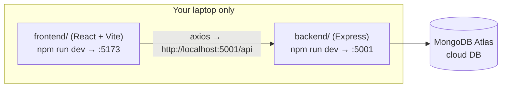
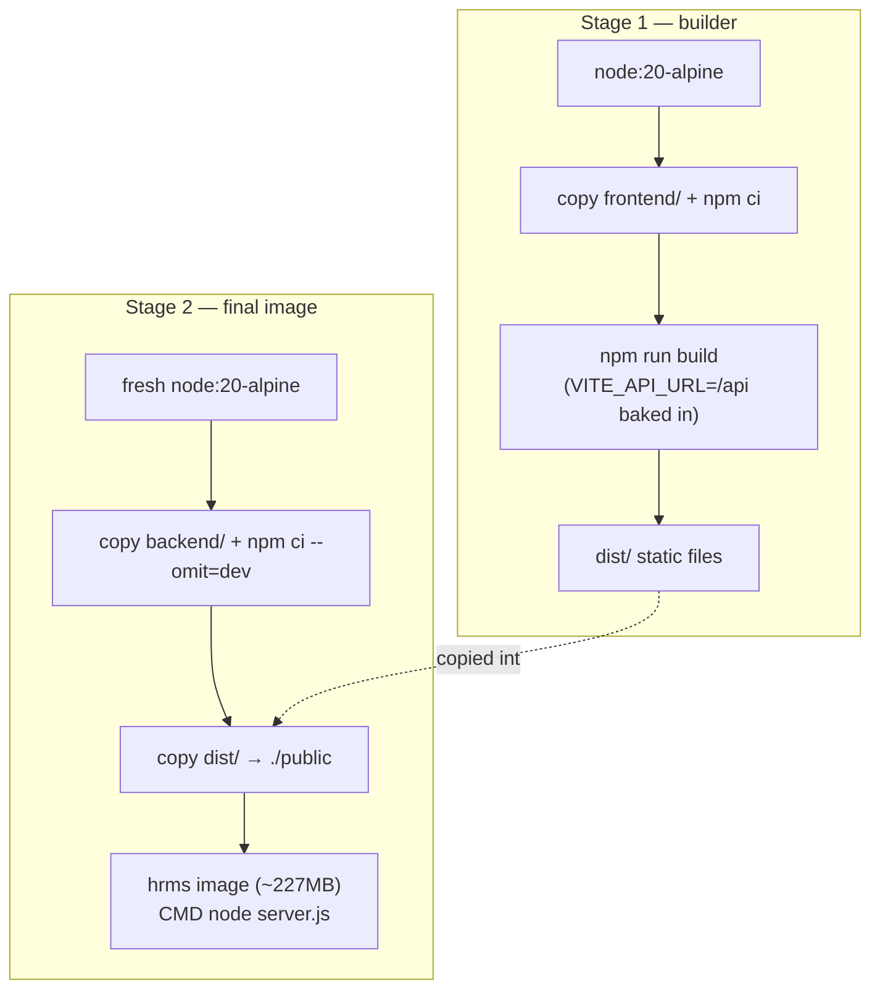
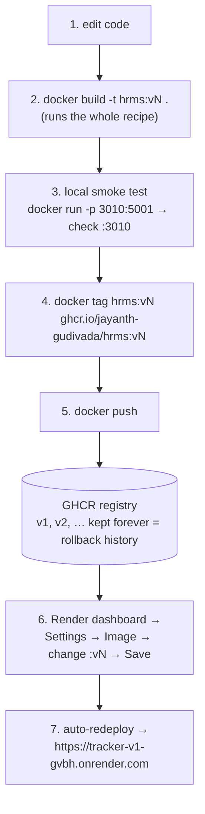
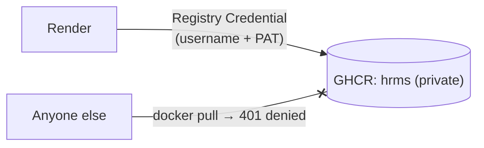
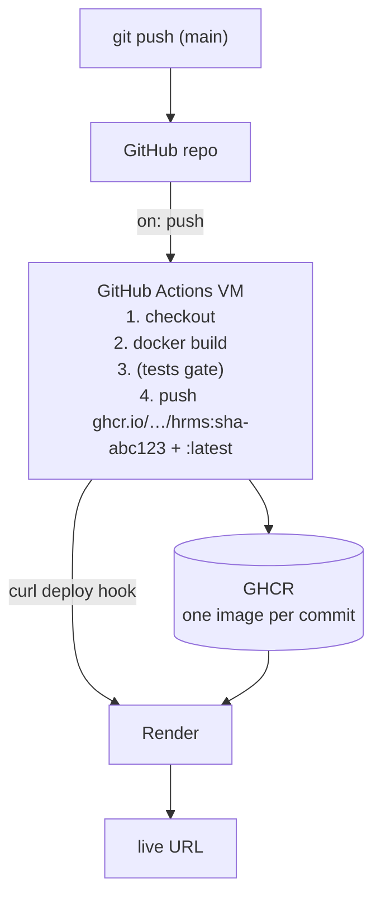

# Deployment Journey — Task Tracker (hrms)

How this project went from "runs on my laptop" to a live URL, first **manually**
(to learn every moving part), and next via **automation** (to stop doing the
repetitive parts by hand).

- Live URL: https://tracker-v1-gvbh.onrender.com
- Image: `ghcr.io/jayanth-gudivada/hrms` (private)
- Render service: `tracker:v1` (Free tier)

---

## 0. Where we started

Two independent apps, both only reachable on `localhost`:



Problems for hosting:
1. `localhost:5001` is hardcoded in frontend code — meaningless on the internet.
2. Two apps = two servers = two URLs = CORS pain.
3. A cloud machine has none of our Node/deps/files installed.

---

## 1. Code preparation (one-time changes)

| Change | File | Why |
|---|---|---|
| Centralized API base URL into one export (`API_URL`), value comes from `VITE_API_URL` env, default `/api` in production | `frontend/src/services/api.js` (+ 5 call sites fixed) | Relative `/api` = "same site I was loaded from" — works anywhere, no hardcoded host |
| Express serves the built React files from `public/` + SPA fallback for non-`/api` routes | `backend/server.js` | One server handles both website and API → one container, one URL, zero CORS |
| Multi-stage `Dockerfile` at repo root | `Dockerfile` | The build recipe (below) |
| `.dockerignore` excluding `node_modules`, `dist`, **`.env`** | `.dockerignore` | Keeps image small and **keeps secrets out of the image** |

### The Dockerfile recipe



Two stages so build tools never ship in the final image.

**Key rule learned:** secrets (`MONGO_URI`) are NEVER in the image — they are
injected at runtime as environment variables. A public image is downloadable by
anyone; an image layer never forgets a file even if a later version deletes it.

---

## 2. Manual pipeline (what I do by hand today)



### Exact commands

```powershell
docker build -t ghcr.io/jayanth-gudivada/hrms:v2 .
docker run -d --name hrms_test --env-file backend\.env -p 3010:5001 ghcr.io/jayanth-gudivada/hrms:v2
# browse http://localhost:3010 … then:
docker rm -f hrms_test
docker push ghcr.io/jayanth-gudivada/hrms:v2
# then Render → Settings → Image URL → :v2 → Save
```

---

## 3. Registry setup (GHCR) — how it was initialised

### 3a. Authentication (PAT)

1. GitHub → Settings → Developer settings → **Personal access token (classic)**
   - scope: `write:packages` (includes read) · expiry 30 days
2. One-time login on the laptop (credential stored in Windows credential manager):
   ```powershell
   docker login ghcr.io -u jayanth-gudivada   # password = the PAT
   ```

**PAT expiry playbook (day 31):** the live app is unaffected. Only `docker push`
(and Render pulls, once private) start failing. Fix: regenerate token on GitHub →
`docker login` again → update Render Registry Credential.

### 3b. Public phase (first deploy)

- Package pushed → GitHub → Packages → `hrms` → settings → visibility **Public**
- Render could pull with **no credentials**
- Trade-off: anyone could `docker pull` and read the backend source (Node ships
  readable JS; frontend is only the minified bundle)

### 3c. Private phase (current)



Order mattered — credential first, then flip visibility, so Render never hits a
locked door:
1. Render → Account Settings → **Registry Credentials** → add (ghcr.io,
   username, PAT)
2. Service → Settings → Image → select that credential
3. GitHub package settings → Danger Zone → visibility **Private**

Verified: anonymous pull now returns 401; Render pulls fine.

---

## 4. Render runtime setup

| Setting | Value | Why |
|---|---|---|
| Service type | Web Service → **Existing Image** | We ship images, Render just runs them |
| Image URL | `ghcr.io/jayanth-gudivada/hrms:v1` | The shelf address |
| Env var `MONGO_URI` | Atlas connection string | Secret injected at runtime, never in image |
| Port | none needed | Render injects `PORT`; `server.js` reads `process.env.PORT` |
| Atlas Network Access | allow Render IPs (or 0.0.0.0/0 for demo) | Mongo's firewall |

Free-tier behaviour: instance **spins down after ~15 min idle**; the next
request takes ~50s and some requests during wake-up get dropped by Render's
edge (`x-render-routing: no-server`). Not a code bug.

---

## 5. Why automate — the pain list

Manual cycle = 4 human steps per deploy, ~10 minutes, and:

- forget one step → prod runs stale code
- no automatic link between an image and the commit that produced it (no git yet!)
- "tested on my machine" is the only quality gate
- deploys stop when I'm away

---

## 6. Target: industry-standard pipeline (GitHub Actions)

One human step (`git push`) — a robot does the exact same commands from §2:



What changes vs manual:

| | Manual (now) | Actions (target) |
|---|---|---|
| Human steps | 4 | 1 — `git push` |
| Build machine | my laptop | clean cloud VM (reproducible) |
| Image ↔ code | untracked | commit SHA in the tag |
| Rollback | remember old tag, click UI | redeploy any SHA in seconds |
| Registry auth | my 30-day PAT | GitHub's auto-managed `GITHUB_TOKEN` (no expiry pain) |
| History | none | full git log + PR review possible |

Setup order (next session):
1. `git init` — **verify `.gitignore` covers `backend/.env` first**
2. First commit → create GitHub repo → push
3. Add `.github/workflows/deploy.yml` (build → push GHCR → curl Render deploy hook)
4. Render → Settings → copy **Deploy Hook URL** → save as GitHub repo secret
5. Test: tiny change → `git push` → watch Actions tab → site updates itself

---

## 7. Quick troubleshooting table

| Symptom | Cause | Fix |
|---|---|---|
| `Image pull failed` event in Render | package private, no/expired credential | add/update Registry Credential, redeploy |
| `docker push` → `denied` | PAT expired or not logged in | regenerate PAT, `docker login ghcr.io` |
| Live URL slow first hit / brief 404 `no-server` | free tier cold start | wait ~50s, or paid tier |
| App up but DB errors in logs | Atlas Network Access blocklist | allow Render outbound IPs |
| Frontend calls localhost in prod | hardcoded URL crept back in | always use `API_URL` from `services/api.js` |

---

## 8. Mental model (one line)

> Dockerfile = recipe · image = frozen meal · GHCR = warehouse ·
> Render = microwave serving it at a public address · env vars = sauce added at
> serving time · GitHub Actions = the robot chef that reruns the recipe on every
> `git push`.
