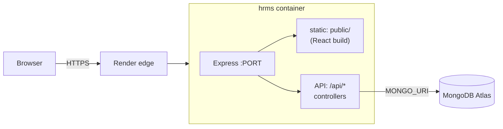
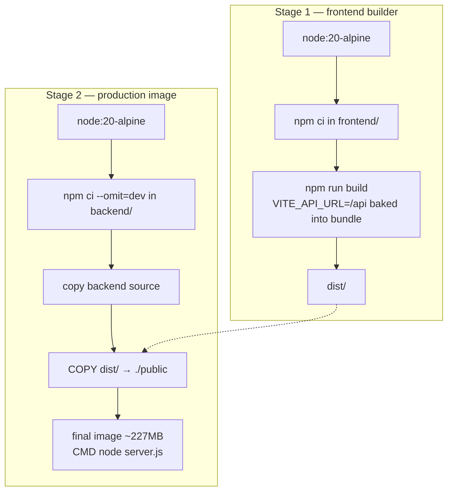
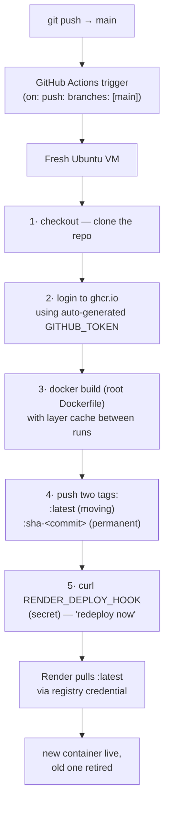

# Task Manager (hrms)

Full-stack task tracker with a calendar UI, performance analytics, and Excel
export — deployed as a **single Docker container** with a fully automated
**git-push-to-live** CI/CD pipeline.

- **Live**: https://tracker-v1-gvbh.onrender.com
- **Image**: `ghcr.io/jayanth-gudivada/hrms` (private, GHCR)
- **Deploy journey & troubleshooting**: [DEPLOYMENT.md](DEPLOYMENT.md)

---

## Table of contents

1. [What the app does](#1-what-the-app-does)
2. [Technology stack — what, why, how](#2-technology-stack)
3. [Architecture](#3-architecture)
4. [Project structure](#4-project-structure)
5. [How a request flows in production](#5-how-a-request-flows-in-production)
6. [The Docker image](#6-the-docker-image)
7. [How code goes live — the CI/CD pipeline](#7-cicd-pipeline)
8. [Secrets & credentials](#8-secrets--credentials)
9. [Local development](#9-local-development)
10. [API reference](#10-api-reference)
11. [Rollback & versioning](#11-rollback--versioning)

---

## 1. What the app does

- **Calendar view** — month grid showing tasks on their date ranges; create,
  edit, delete tasks via a dialog; "upcoming tasks" side panel.
- **Performance view** — metric cards (on-time completion rate, average
  response time, totals), paginated history of completed tasks, one-click
  Excel export of the full history.
- Tasks live in MongoDB with `status: 1` (active) / `status: 0` (completed)
  and a `completedAt` timestamp used for the analytics.

---

## 2. Technology stack

### 2.1 Frontend

| Technology | Role | How it works here |
|---|---|---|
| **React 19** | UI library | The interface is a tree of components (`App` → `CalendarPage` → `CalendarGrid`…). Each component is a function returning markup; when state changes React re-renders only the affected parts of the page. No full page reloads — this is a Single Page Application (SPA). |
| **Vite** | Build tool & dev server | Two jobs. *Dev*: `npm run dev` serves source files directly with instant hot-reload. *Build*: `npm run build` compiles all JSX, bundles and minifies everything into a handful of static files in `dist/` — plain HTML/JS/CSS any browser (and any server) can handle. At build time Vite **bakes environment variables into the bundle**: `import.meta.env.VITE_API_URL` is replaced with its literal value, which is why the API URL is a *build-time* decision, not a runtime one. |
| **MUI v7** (Material UI) | Component library | Ready-made, themed React components — `Dialog`, `Table`, `DatePicker`, icons — so the app gets a consistent, accessible design without hand-rolling CSS. A central `createTheme` call defines colors/typography once. |
| **Axios** | HTTP client | Wraps `fetch` with a cleaner API. Every backend call goes through **one module**: [`frontend/src/services/api.js`](frontend/src/services/api.js) exports `API_URL` (from `VITE_API_URL`, default `/api`) and a `taskService` with typed methods (`getAllTasks`, `createTask`, …). One place to change if the backend ever moves. |
| **React Context** | App-wide state | [`TaskContext.jsx`](frontend/src/context/TaskContext.jsx) is a shared store: tasks, stats, completed history, loading flags. Pages call `useTasks()` to read it. First fetch is cached (an `initialized` flag prevents duplicate loads); after any mutation `refreshAll()` re-fetches tasks + stats so every view stays consistent. |
| **date-fns / dayjs** | Date handling | Parsing, formatting, and comparing dates for the calendar grid and reports. |
| **xlsx (SheetJS)** | Excel export | Converts the completed-task JSON into a real `.xlsx` workbook **entirely in the browser** — no server involvement. |

### 2.2 Backend

| Technology | Role | How it works here |
|---|---|---|
| **Node.js 20** | JavaScript runtime | Runs JS outside the browser. Single-threaded with an event loop: while one request waits on the database, Node serves others — good fit for I/O-heavy APIs. |
| **Express 5** | Web framework | Maps URL + HTTP method to handler functions. [`server.js`](backend/server.js) wires: JSON body parsing → request logging → `/api/tasks` routes → `/api/health` → static frontend files → SPA fallback. Middleware chain: every request passes through each `app.use` in order. |
| **MongoDB driver** | Database access | Direct queries against Atlas: `find`, `insertOne`, `findOneAndUpdate`, `deleteOne`, `countDocuments`. Controllers in [`taskController.js`](backend/controllers/taskController.js) implement each endpoint, including a paginated completed-list and an aggregate stats endpoint. |
| **MongoDB Atlas** | Managed cloud database | MongoDB hosted by MongoDB Inc. — no DB server to install, patch, or back up. The app connects with a connection string (`MONGO_URI`). Access is guarded two ways: credentials in the URI + an IP allow-list (Network Access) on the Atlas side. |
| **dotenv** | Env loading (dev) | Reads `backend/.env` into `process.env` for local runs. In production the platform (Render) injects env vars directly — the file never leaves the laptop. |
| **CORS middleware** | Cross-origin safety valve | Only relevant in local dev, where frontend (`:5173`) and backend (`:5001`) are different origins. In production both share one origin, so CORS never triggers. |

### 2.3 Delivery / infrastructure

| Technology | Role | How it works here |
|---|---|---|
| **Docker** | Packaging & isolation | Freezes app + runtime + dependencies into an **image** — a portable, layered filesystem snapshot. A running image is a **container**: isolated process with its own filesystem and network. Same image runs identically on a laptop, CI VM, or Render. |
| **GHCR** | Image registry | `ghcr.io/jayanth-gudivada/hrms` stores every built image version. Private: pulls require authentication. Acts as the hand-off point between CI (which pushes) and Render (which pulls). |
| **Render** | Hosting platform (PaaS) | Runs the container 24/7 behind HTTPS at a public URL. Injects `PORT` and `MONGO_URI` at start. Free tier spins the instance down after ~15 min idle (first request after that takes ~50 s). |
| **Git + GitHub** | Version control & collaboration | Every change is a commit — a permanent, attributed snapshot. GitHub hosts the repo and provides the automation runtime. |
| **GitHub Actions** | CI/CD | The robot that rebuilds and redeploys on every push — detailed in [§7](#7-cicd-pipeline). |

---

## 3. Architecture

Single-container design: one Express process serves **both** the compiled
React frontend and the JSON API.



Why one container instead of separate frontend + backend services:

1. **One URL, no CORS** — the browser loads the page and calls the API on the
   same origin; the relative path `/api` works everywhere.
2. **One thing to version, deploy, roll back** — a single image is the unit of
   release.
3. **Fits the platform** — one Render service, one registry package.

The trade-off (fine at this scale): frontend and backend can't scale
independently.

---

## 4. Project structure

```
mypro/
├── Dockerfile                  # multi-stage build → single production image
├── docker-compose.yml          # local one-command run (port 3003)
├── .dockerignore               # keeps node_modules/.env/dist out of the image
├── .github/workflows/deploy.yml# CI/CD pipeline definition
├── DEPLOYMENT.md               # deploy journey, diagrams, troubleshooting
│
├── backend/
│   ├── server.js               # Express bootstrap: middleware, Mongo connect,
│   │                           #   routes, static serving + SPA fallback
│   ├── routes/taskRoutes.js    # URL → controller mapping for /api/tasks
│   ├── controllers/taskController.js  # business logic + DB queries
│   └── models/Task.js          # (Mongoose schema — reference only, unused)
│
└── frontend/
    ├── vite.config.js
    ├── index.html              # SPA shell
    └── src/
        ├── main.jsx            # entry: mounts <App/>
        ├── App.jsx             # theme, layout, sidebar, view switching
        ├── context/TaskContext.jsx    # shared data store + caching
        ├── services/api.js     # API_URL + all HTTP calls (single source)
        ├── pages/
        │   ├── CalendarPage.jsx       # calendar + upcoming + task dialog
        │   └── PerformancePage.jsx    # metrics, history table, Excel export
        ├── components/         # CalendarGrid, TaskDialog, Header, …
        └── utils/TaskColors.js # priority → color mapping
```

---

## 5. How a request flows in production

**Page load** (`GET /`):

1. Browser resolves `tracker-v1-gvbh.onrender.com` → Render's edge.
2. Render forwards to the container; Express matches no API route, so the
   static middleware returns `public/index.html` plus the JS/CSS bundle.
3. React boots in the browser and immediately calls `GET /api/tasks`.

**API call** (`GET /api/tasks`):

1. Same origin → no CORS preflight. Request hits Express.
2. Route table sends it to `taskController.getAllTasks`.
3. Controller queries Atlas: `find({status: 1}).sort({startDate: 1})`.
4. JSON array returns; React Context stores it; the calendar renders.

**Client-side navigation** (`/performance`):

- React swaps the view in the browser — no server request. If the user
  *refreshes* on that URL, the SPA fallback in `server.js` returns
  `index.html` for any non-`/api` path and React restores the right view.

---

## 6. The Docker image

Built by the root [`Dockerfile`](Dockerfile) in two stages:



Why multi-stage: stage 1's build tooling (Vite, dev dependencies, source JSX)
never enters the final image — smaller and less to leak.

Rules encoded here:

- `npm ci` (not `install`) → exact versions from the lockfile, reproducible.
- `.dockerignore` excludes `node_modules`, `dist`, and **`.env`** — secrets
  physically cannot end up in a layer.
- The image is **environment-agnostic**: it reads `PORT` and `MONGO_URI` at
  startup, so the same bytes run locally and in production.

---

## 7. CI/CD pipeline

Defined in [`.github/workflows/deploy.yml`](.github/workflows/deploy.yml).
The entire human workflow is:

```powershell
git add -A
git commit -m "describe the change"
git push
```

Everything after that is automatic:



Step details:

| Step | Mechanism |
|---|---|
| **Trigger** | GitHub fires the workflow on any push to `main` (also runnable manually via `workflow_dispatch`). |
| **GITHUB_TOKEN** | Auto-generated per run, scoped by `permissions: packages: write`, expires when the run ends. No stored password, nothing to rotate. The `hrms` package grants this repo write access (package settings → Manage Actions access). |
| **Build cache** | `cache-from/to: type=gha` reuses unchanged Docker layers between runs — typical rebuilds take ~1 min instead of ~3. |
| **Two tags** | `:latest` is what Render follows; `:sha-<commit>` pins the exact code version forever — the audit trail and rollback lever. |
| **Deploy hook** | A secret Render URL stored as the `RENDER_DEPLOY_HOOK` repo secret. `curl -fsS` fails the workflow loudly if the hook errors. |

What automation replaced:

| Manual era (4 steps, ~10 min, error-prone) | Automated (1 step, ~30 s of human time) |
|---|---|
| `docker build` on laptop | clean CI VM builds |
| eyeball test | (test gate can be added before push step) |
| `docker push` with personal PAT | GITHUB_TOKEN, auto-rotated |
| edit image tag in Render UI | deploy hook fires automatically |
| no record of what was deployed | every deploy ↔ commit ↔ sha-tagged image |

---

## 8. Secrets & credentials

| Secret | Lives where | Used for |
|---|---|---|
| `MONGO_URI` | `backend/.env` (local, git-ignored) · Render env vars (production) | DB connection. **Never** in code, git, or the image. |
| GitHub PAT (`ghcr-push`, 30-day expiry) | Laptop credential manager · Render Registry Credential | Manual pushes from the laptop; Render's pulls of the private image. On expiry: regenerate → update both places ([DEPLOYMENT.md §3a](DEPLOYMENT.md)). |
| `RENDER_DEPLOY_HOOK` | GitHub repo → Actions secrets | Lets CI tell Render to redeploy. Treat as secret — anyone with the URL can trigger deploys. |
| `GITHUB_TOKEN` | Nowhere (generated per CI run) | CI's push to GHCR. |

Defense layers: `.gitignore` blocks `.env` from git → `.dockerignore` blocks
it from the image → Atlas IP allow-list blocks unknown networks → private
registry blocks image download.

---

## 9. Local development

```powershell
# hot-reload development (two terminals)
cd backend;  npm run dev     # nodemon on :5001
cd frontend; npm run dev     # vite on :5173, proxies nothing — calls :5001 directly

# production-like run (single container, http://localhost:3003)
docker compose up --build
```

Requirements: Node 20+, Docker Desktop, `backend/.env` containing `MONGO_URI`.

---

## 10. API reference

Base: `/api`

| Method & path | Purpose | Notes |
|---|---|---|
| `GET /health` | Liveness check | `{status:'ok'}` |
| `GET /tasks` | Active tasks | `status:1`, sorted by `startDate` |
| `POST /tasks` | Create task | body: `title, description, startDate, endDate, priority` |
| `PUT /tasks/:id` | Update task | setting `status:0` stamps `completedAt` |
| `DELETE /tasks/:id` | Delete task | |
| `GET /tasks/upcoming` | Next 10 by deadline | active only, `endDate >= today` |
| `GET /tasks/completed?page&limit` | Paginated history | `limit=all` returns everything (Excel export) |
| `GET /tasks/stats` | Analytics | on-time completion %, avg hours to complete, totals |

---

## 11. Rollback & versioning

Every commit produces an immutable image `ghcr.io/jayanth-gudivada/hrms:sha-<commit>`.

To roll back:
1. Find the last good commit (`git log` or the repo's Actions history).
2. Render → service → Settings → Image URL → set `:sha-<that commit>` → Save.
3. Render redeploys that exact version in seconds — no rebuild.

To return to normal: set the URL back to `:latest`.
